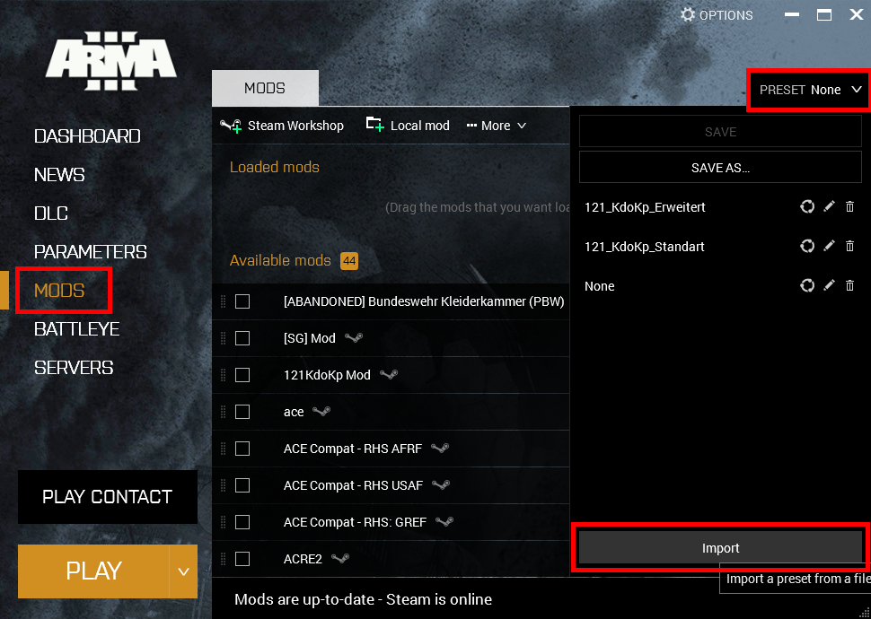

# Willkommen auf der KnowHow Seite

## Installation der Mods

### Herunterladen der Modpakete

Auf dem [Discord Server](https://discord.gg/GZftD2z3X2) in dem Info Channel die HTML Dateien herunterladen.  
  
Die Mods aus dem Paket `Standard` werden zwingend benötigt. Bei dem Paket `Erweitert` handelt es sich um optionale Mods.  

### Importieren der Modpakete

Über den Arma Launcher lassen sich die Modpakete importieren.  
Dazu auf einfach auf die Schaltfächen ```Mods->Preset->Import``` klicken wie in der folgenden Grafik gezeigt:  
  

### Modpaket auswählen

Mit dem `Preset` Button aus dem vorherigen Screenshot lassen sich jetzt die importierten Modpakete auswählen.  
Das `Standard` Paket enthält die erforderlichen Mods.  
Das `Erweitert` Paket enthält die Mods aus dem `Standard` Paket und zusätzlich die optionalen Mods.  
